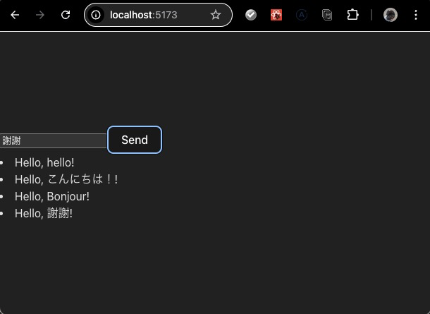
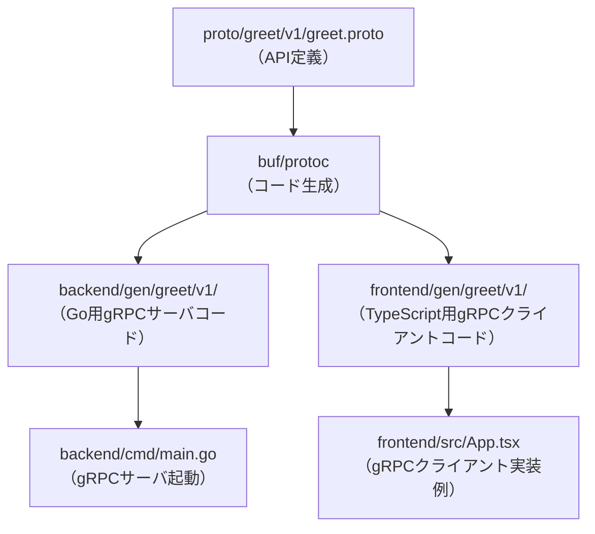

# はじめに

本プロジェクトはgPRCの勉強のために作っています。モノレポでバックエンドフロントエンド完結した形で、サービス開発ができる準備を整えることを目標としました。ポイントは以下です。
- ディレクトリ構成は、今回はproto、backend、frontendに分離しました。
- protoにAPIのスキーマを定義
- backend / frontend にbuf generateでコード生成
- backendでgoのアプリ開発
- frontendでreactのアプリ開発
- docker-composeで環境が立ち上がる

## セットアップ手順

1. リポジトリをクローン
   ```sh
   git clone https://github.com/kiitosu/connect-go-react-template.git
   cd connect-go-react-template
   ```

2. バックエンドサーバー起動
   以下すべて実行されます
   - フロントエンドパッケージインストール
   - protoファイルからのコード生成
   - バックエンドのビルド
   - バックエンドのDockerを開始
   ```sh
   npm all
   ```

3. フロントエンド起動
   ```sh
   npm run dev
   ```

4. ブラウザで `http://localhost:5173/` にアクセス




---
以下はclineがまとめてくれた情報になっています。

# by cline
### なぜこのプロジェクトが存在するのか
- GoバックエンドとReactフロントエンド間でgRPC通信を行う際、セットアップやAPIスキーマ管理、開発環境構築に多くの手間がかかる。
- connect-go/connect-webの導入・運用ノウハウが分散しており、ベストプラクティスが見えづらい。
- プロトコルバッファやDockerを活用したモダンなフルスタック開発の標準構成が求められている。

### 解決する課題
- gRPC+connectプロトコルによるAPI連携の導入障壁を下げる
- バックエンド・フロントエンドの分離開発を容易にする
- APIスキーマの一元管理と自動生成の仕組みを提供
- Docker Composeによる環境構築の簡易化
- 新規プロジェクト立ち上げ時の初期構成検討の手間を削減

### 理想的なユーザー体験
- 最小限のセットアップでgRPC通信が動作する
- APIスキーマの変更が即座に各層へ反映される
- バックエンド・フロントエンドの開発が独立して進められる
- Docker Composeで一発起動・一発停止が可能
- サンプルAPIを通じて実装イメージを素早く掴める

### 想定ユーザー
- gRPC/Protocol Buffers/Connectの導入を検討しているフルスタックエンジニア
- モダンなAPI連携のベストプラクティスを学びたい開発者
- 新規プロジェクトの雛形を探しているチーム

## System Patterns

### 主要設計パターン・技術的意思決定
- **APIファースト開発**: protoでAPI定義→自動生成→各層で利用
- **gRPC+Connectプロトコル**: HTTP/2ベースの高速通信、型安全なAPI
- **分離開発**: バックエンド・フロントエンドを独立して開発・デプロイ可能
- **Docker Composeによる一括起動**: サービス間連携の容易化
- **サンプルサービス**: greetサービス（gen/greet/v1/配下）

### システムアーキテクチャ概要
- **バックエンド**: Go（connect-go）によるgRPCサーバ
- **フロントエンド**: React（TypeScript, connect-web）によるgRPCクライアント
- **APIスキーマ管理**: Protocol Buffers（protoディレクトリ）
- **コード生成**: buf, protoc, connect-go, connect-web
- **開発環境統合**: Docker, Docker Compose
- **フロントエンド開発**: Vite, ESLint, TypeScript

### ディレクトリ構成

```
go-grpc-connect/
├── backend/         # Go製gRPCサーバの実装・生成コード
│   ├── cmd/         # サーバ起動用main.go
│   ├── gen/         # protoから生成されたGoコード
│   ├── go.mod       # Goモジュール管理ファイル
│   └── go.sum
├── frontend/        # React(TypeScript)製gRPCクライアント
│   ├── gen/         # protoから生成されたTypeScriptコード
│   ├── public/      # 静的ファイル
│   ├── src/         # フロントエンドアプリ本体
│   ├── package.json # フロントエンド依存管理
│   └── ...          # 各種設定ファイル
├── proto/           # APIスキーマ（Protocol Buffers定義）
│   ├── greet/       # サービスごとのprotoファイル
│   ├── buf.yaml     # buf設定ファイル
│   └── buf.gen.yaml # bufコード生成設定
├── docker-compose.yml # サービス一括起動用
├── Dockerfile         # サーバ用Dockerビルド定義
├── package.json       # プロジェクト全体の依存管理（必要に応じて）
└── README.md          # プロジェクト概要
```

### コンポーネント関係図（Mermaid）



### その他
- ESLint, TypeScript, Viteによるフロントエンド品質担保
- Dockerfile, docker-compose.ymlで開発・本番環境の統一
